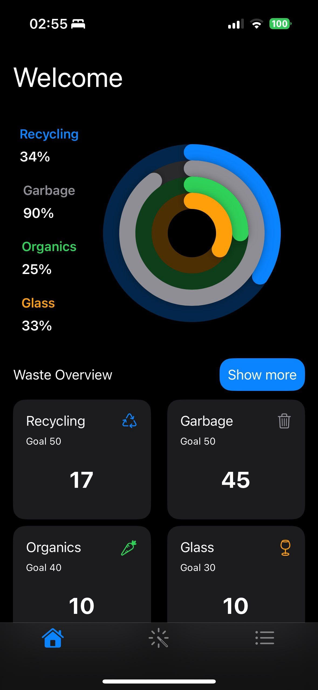
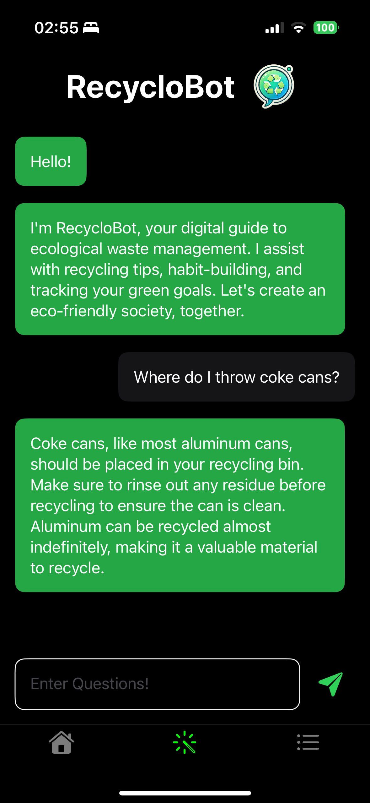
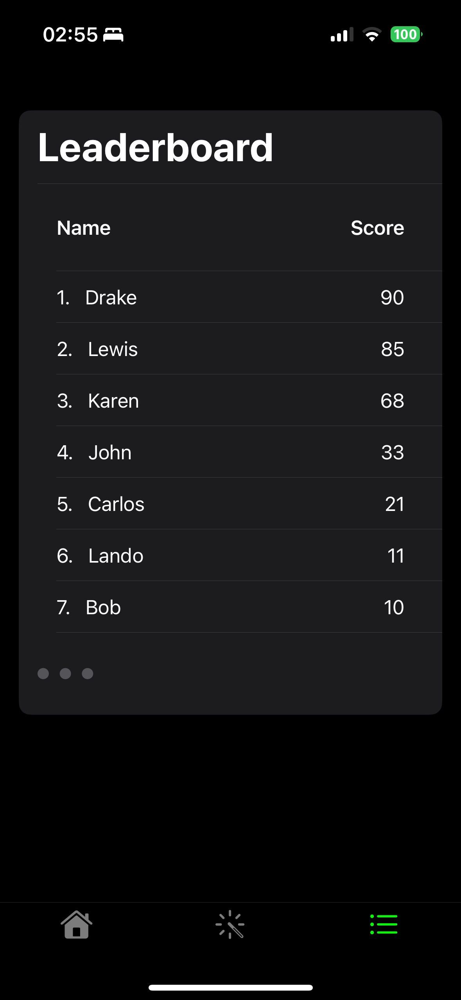
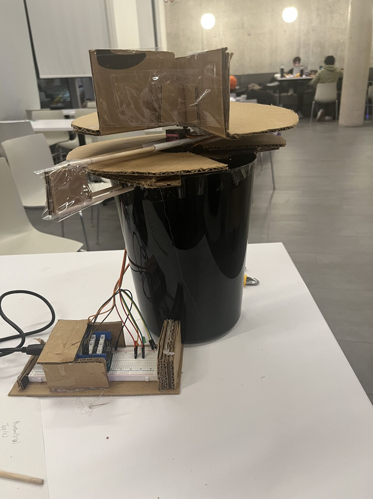
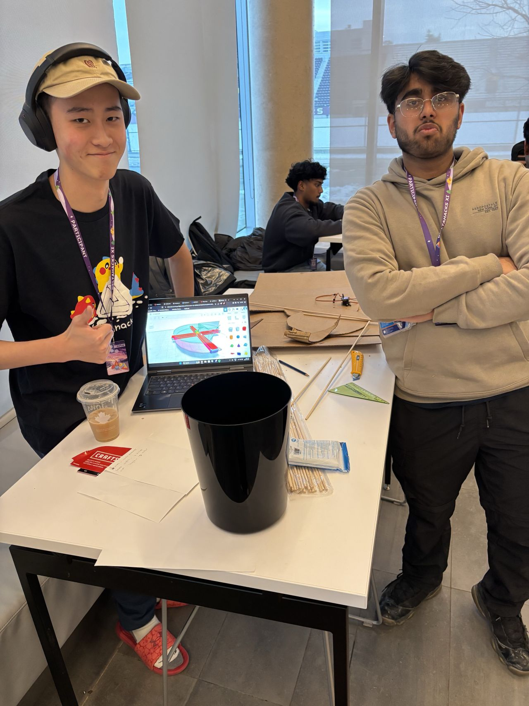

# **RecycloBot 🌍♻️**  
**DeltaHacks 11 | McMaster University**  
Team: Karl-Alexandre Michaud, Kabir Kumar, Aaron Ren, Dharav Shah

RecycloBot is an innovative project combining hardware and software to promote eco-friendly habits and waste management awareness. Designed and built during DeltaHacks 11, this project features a smart trash bin powered by Arduino and an iOS app developed with Swift and SwiftUI. Together, they aim to make recycling and waste management more engaging, accessible, and educational for users.  

Our mission is to inspire individuals to take steps toward a greener planet by providing tools to track, learn, and compete in adopting environmentally mindful habits.

Submission: https://devpost.com/software/recyclobot (funny video included XD)

## Table of Contents
- [Contributors](#contributors)
- [Features](#features)
- [License](#license)
- [Feedback and Contributions](#feedback-and-contributions)

## Contributors
We are a team of passionate hackers dedicated to inspiring others to take their first step towards sustainability.
- Kabir Kumar
- Karl-Aexandre Michaud
- Aaron Ren
- Dharav Shah

## **Features**

|  |  |
|------------------------------------------------------|------------------------------------------------------|
|  |  |

### **Hardware:**  
- **Smart Trash Bin**: Divided into sections for recycling, organics, garbage, and glass.  
- **AI-Driven Sorting**: Integrated ChatGPT Visual AI API for real-time video analysis to detect and filter trash into the correct section.  
- **Arduino-Powered**: Utilizes servos to rotate a platform and sort waste accurately.  

### **Software:**  
- **Eco Goal Tracking**: Users set monthly goals for waste management and track their recycling, organics, garbage, and glass disposal habits.  
- **Leaderboards**: Compete with others to become the most eco-friendly and environmentally mindful user.  
- **Educational Chatbot**: Powered by ChatGPT Generative AI, the chatbot assists users in setting achievable goals, answering recycling questions, and building eco-friendly habits.  
- **User Insights**: Visualized data to show progress toward monthly eco goals and comparisons with others.

## License

MIT License

Copyright (c) 2024 RecycloBot Team

Permission is hereby granted, free of charge, to any person obtaining a copy
of this software and associated documentation files (the "Software"), to deal
in the Software without restriction, including without limitation the rights
to use, copy, modify, merge, publish, distribute, sublicense, and/or sell
copies of the Software, and to permit persons to whom the Software is
furnished to do so, subject to the following conditions:

The above copyright notice and this permission notice shall be included in all
copies or substantial portions of the Software.

THE SOFTWARE IS PROVIDED "AS IS", WITHOUT WARRANTY OF ANY KIND, EXPRESS OR
IMPLIED, INCLUDING BUT NOT LIMITED TO THE WARRANTIES OF MERCHANTABILITY,
FITNESS FOR A PARTICULAR PURPOSE AND NONINFRINGEMENT. IN NO EVENT SHALL THE
AUTHORS OR COPYRIGHT HOLDERS BE LIABLE FOR ANY CLAIM, DAMAGES OR OTHER
LIABILITY, WHETHER IN AN ACTION OF CONTRACT, TORT OR OTHERWISE, ARISING FROM,
OUT OF OR IN CONNECTION WITH THE SOFTWARE OR THE USE OR OTHER DEALINGS IN THE
SOFTWARE.

## Feedback and Contributions

The team had a blast at DeltaHacks🎉! We are excited to hear any feedback the project.

### 🐛Feedback Form
Thank you for taking the time to fill out the [feedback form](https://docs.google.com/forms/d/e/1FAIpQLScfwFkdp6zB6mk3h6j-BSNEVJ3rxnqWgt_m5gXf7BIFnVlcjQ/viewform?usp=dialog). As this is the first hackathon for most of our group members, we are looking forward to hear feedback to grow as hackers!
